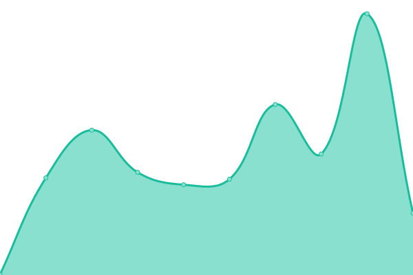
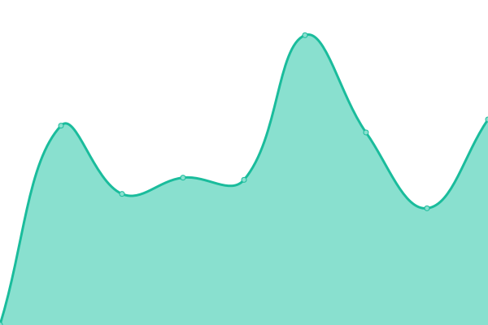

# [📈 Live Status](https://upptime.github.io/upptime): <!--live status--> **🟩 All systems operational**

This repository contains the open-source uptime monitor and status page for [Upptime](https://upptime.js.org), powered by [Upptime](https://github.com/upptime/upptime).

With [Upptime](https://upptime.js.org), you can get your own unlimited and free uptime monitor and status page, powered entirely by a GitHub repository. We use [Issues](https://github.com/upptime/upptime/issues) as incident reports, [Actions](https://github.com/themonetizr/upptime/actions) as uptime monitors, and [Pages](https://upptime.github.io/upptime) for the status page.

<!--start: status pages-->
<!-- This summary is generated by Upptime (https://github.com/upptime/upptime) -->
<!-- Do not edit this manually, your changes will be overwritten -->
<!-- prettier-ignore -->
| URL | Status | History | Response Time | Uptime |
| --- | ------ | ------- | ------------- | ------ |
|  [Monetizr API](https://api3.themonetizr.com) | 🟩 Up | [monetizr-api.yml](https://github.com/themonetizr/upptime/commits/HEAD/history/monetizr-api.yml) | 

 219ms
     
 | 

<a href="https://status.themonetizr.com/history/monetizr-api">100.00%</a>
    

|  [Console](https://api.themonetizr.com) | 🟩 Up | [console.yml](https://github.com/themonetizr/upptime/commits/HEAD/history/console.yml) | 

 220ms
     
 | 

<a href="https://status.themonetizr.com/history/console">100.00%</a>
    

|  [Image server](https://image.themonetizr.com) | 🟩 Up | [image-server.yml](https://github.com/themonetizr/upptime/commits/HEAD/history/image-server.yml) | 

 385ms
     
 | 

<a href="https://status.themonetizr.com/history/image-server">100.00%</a>
    

|  [Homepage](https://themonetizr.com) | 🟩 Up | [homepage.yml](https://github.com/themonetizr/upptime/commits/HEAD/history/homepage.yml) | 

 1786ms
     
 | 

<a href="https://status.themonetizr.com/history/homepage">100.00%</a>
    

|  [Docs](https://docs.themonetizr.com) | 🟩 Up | [docs.yml](https://github.com/themonetizr/upptime/commits/HEAD/history/docs.yml) | 

 483ms
     
 | 

<a href="https://status.themonetizr.com/history/docs">100.00%</a>
    

<!--end: status pages-->

[**Visit our status website →**](https://themonetizr.github.io/upptime/)

## 📄 License

- Powered by: [Upptime](https://github.com/upptime/upptime)
- Code: [MIT](./LICENSE) © [Upptime](https://upptime.js.org)
- Data in the `./history` directory: [Open Database License](https://opendatacommons.org/licenses/odbl/1-0/)
